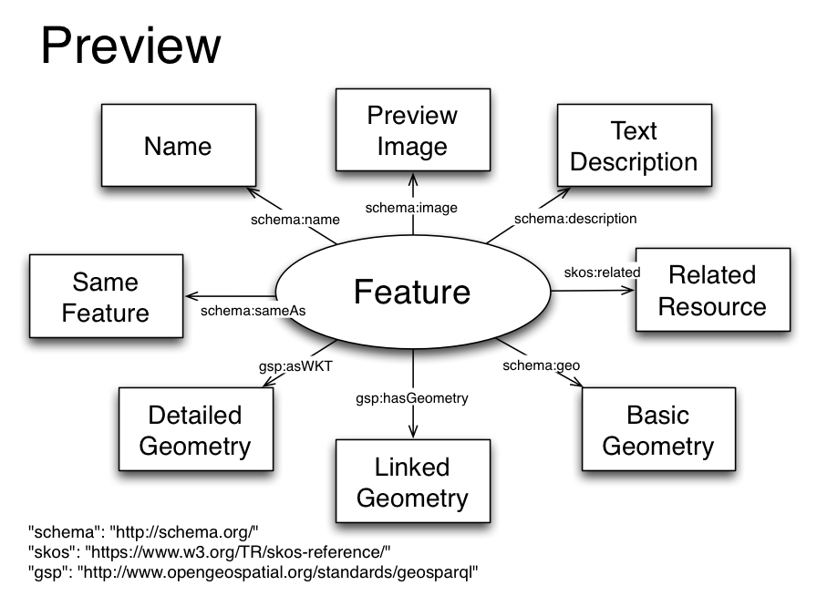
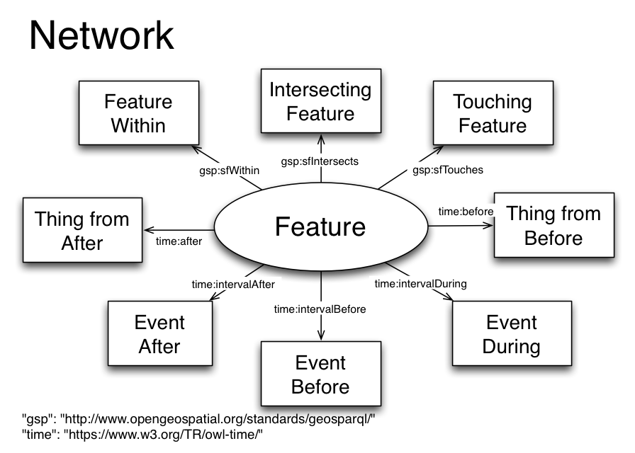
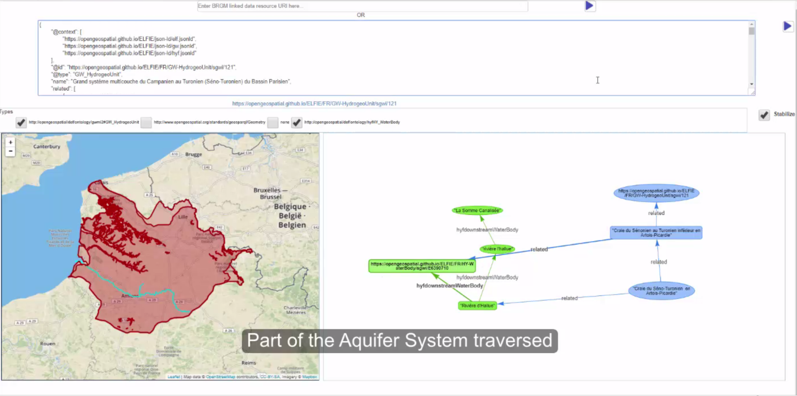
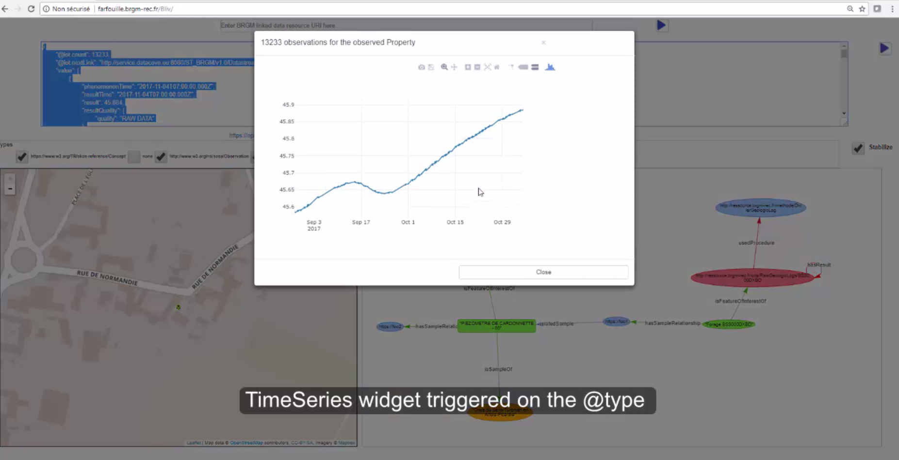

ELFIE Overview and Outcomes
========================================================
author: David Blodgett dblodgett@usgs.gov
date: 11/30/18
autosize: true

Environmental Linked Features Interoperability Experiment (ELFIE)

Demo:
========================================================

https://opengeospatial.github.io/ELFIE/demo/uswb

Goals
========================================================

- **Increase interoperability while decreasing data duplication and maintenance overhead**
- **Combine the power of web services with transparency of linked data**
- **Encode relationships between and among environmental features**
- **Ecode highly general "preview" content for any feature**
- **Utilize commonly used and easily adopted approaches**

Defining the problem... ELFIE was technical.
========================================================

> Current OGC services, while flexible and capable, do not directly allow exposure of features in a **REST-ful** way or provide traversable *hypermedia* describing available **methods**, data, or interfaces to **related (linked) content**.

- REST-ful: GET + "accept: mime-type" gives you the mime-type format if available
- Hypertext: traversable web of text. Hypermedia: traversible web of any data
- methods: the things a service knows how to do
- related (linked) content: things or data from other services that are related

Linked data graph views
========================================================

Linked data graph views
========================================================

Monitoring, and domain data models
========================================================

- Sensors, Observations, Samples and Actuators (SOSA)
- Timeseries Markup Language (TimeseriesML)
- Surface Hydrology Features (HY_Features)
- Growndwater Markup Language 2 (GWML2)
- Geoscience Markup Language 4 (GeoSciML)
- Soils Interoperability Experiment (SoilIEML)
- Floodcast (Experimental)

Use Cases: Watershed Data Index
========================================================

Use Cases: US Water Budgets
========================================================

Use Cases: Surface-Ground Water Networks Interaction
========================================================

Use Cases: Ground Water Monitoring
========================================================

Use Cases: FloodCast
========================================================

Outcomes
========================================================

- [Engineering Report to be Presented to OGC December 2018.](https://portal.opengeospatial.org/files/?artifact_id=81777&version=1)
- [Web summary of use cases available now.](https://opengeospatial.github.io/ELFIE/)
- [JSON-LD contexts](https://opengeospatial.github.io/ELFIE/json-ld)
- [Example JSON-LD files](https://opengeospatial.github.io/ELFIE/file_index)

Findings
========================================================

- WFS 3 should be well suited to the needs of ELFIE use cases
- Ontologies for existing and pending data standards need to be published.
- Data providers need to publish URIs for their features or this won't work.
- Future work needs to consider how to discover "views" of a given feature.

HTTP Range-14 and Cool URIs:
========================================================
- Http URIs (http://bing/bang/boom/) usually identify a specific digital resource
- Http URIs can also be identifiers for non-digital things, e.g. rivers, wells, etc
- Hyper text transport protocol (http) as a function whose domain is a URI
- The range of http is usually the digital resource identified by a URI.
- For a URI that identifies a non-digital thing...
  **the range of the http function is undefined.**

#### Enter Cool URIs
_Cool URIs Resolve_ -- for a non-digital thing they resolve a 303-see other.

But then what?!?!?
========================================================

# To Be Continued...
### Join the Second Environmental Linked Features Interoperability Experiment
(SELFIE)
